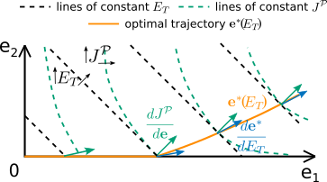
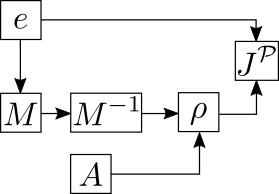

# Optimal spatial arrangement of enzymes for a single-step reaction in a 2D system

(c) 2022 Giovanni Giunta, Filipe Tostevin

This software was used in the manuscript "Optimal spatial allocation of enzymes as an investment problem" by Giunta G. * , Tostevin F. *  , Tǎnase-Nicola S. & Gerland U. (*full publication details to follow*). 

## Description

The algorithm tracks the optimal enzyme arrangement for a single step reaction, as the amount of enzymes in the system gradually increases. 
It is the result of an analytical calculation that shows that every position of the optimal enzyme arrangement generates the same marginal returns of product flux per extra enzymes added at each position. 

Here is a 2-D sketch of the optimal trajectory in enzyme space in the case of a 1D system with two sites. Substrate enters the system at the first site and it exits at the second.

For low amount of enzymes, the marginal returns vector, $\frac{dJ^P}{d\mathbf{e}}$ (green arrows), has its largest component in the direction of highest returns, $e_1$.
Hence the optimal strategy is to add an extra amount of enzymes, $\delta E_T$, at the position $r_1$. 
As $e_1$ increases the returns coming from position $r_1$ decrease, and the returns generated from position $r_2$ become relatively higher. 
For a certain value of $E_T$, $e_1$ and $e_2$ generate the same returns and the vector $\frac{dJ^P}{d\mathbf{e}}$ starts pointing in the $(1,1)$ direction.
This is the transition point from an optimal clustered configuration into a more extended profile. 
From the analytical calculations we know that above the transition point the returns vector will always be pointing in the $(1,1)$ direction along the optimal line, as illustrated in the sketch.

However, to follow the optimal trajectory, as we increase the amount of enzymes in the system, we need to determine the tangent vectors, $\frac{d\mathbf{e}^*}{dE_T}$ (blue arrows), to the optimal trajectory. These are given by the linear system

$$\mathbf{H}\frac{d\mathbf{e}^*}{dE_T}=\frac{d\lambda_e}{dE_T} \mathbf{1},$$

where $\mathbf{H}$ is the Hessian matrix of $J^P$ in the space of enzyme densities at positions where the marginal returns $\frac{dJ^P}{d\mathbf{e}}$ is largest, and $\lambda_e$ is an $E_T$ dependent cost of adding extra enzymes into the system.
The quantity of interest is therefore the vector $\frac{d\mathbf{e}^*}{dE_T}$, that prescribes how enzymes should be added at different positions to reach the new optimal enzyme configuration.

## Algorithm

1. Begin with $\mathbf{e}=0$.
2. For each site $\mathbf{r_i}$, evaluate the marginal returns for adding enzymes at that position, $\frac{dJ^P}{de_i}$.
3. Identify the subset of positions at which the returns are equal to (or within a desired numerical tolerance of) the maximal returns.
4. For this subset of positions, evaluate the Hessian matrix of the flux with respect to the enzyme densities, $\mathbf{H}$.
5. Solve the linear system $\mathbf{H} \delta \mathbf{e}^* = \mathbf{1}$ for $\delta\mathbf{e}^* $, and normalize such that the total change in the amount of enzymes $\sum_i \delta e_i^{*}=\delta E_T$.
6. Update the optimal enzyme arrangement, $\mathbf{e}^* \rightarrow \mathbf{e}^* +\delta \mathbf{e}^{*}$.
7. Repeat from step 2 until the target total enzyme amount $E_T$ is reached.

### Back-propagation

The derivatives $\frac{dJ^P}{d\mathbf{e}}$ and $\mathbf{H}$ are calculated analytically by back-propagation through the computational dependency graph: 

Here $\mathbf{M}$ is the reaction-diffusion operator on the lattice and $\mathbf{\rho}$ is the substrate density, such that $\mathbf{M}\mathbf{\rho}+\mathbf{A}=0$ with $\mathbf{A}$ the substrate influx vector.

## Parameters
All the parameters are listed in the [params.json](params.json) file. 
Here we illustrate what they are used for.

### Geometry

The system considered in the `master` branch is a 2D rectangle with absorbing boundary conditions with smaller rectangular sources of substrate within it.
- `Nx`: number of sites of the external rectangle along the x-axis.
- `Ny`: number of sites of the external rectangle along the y-axis.

#### Sources

One or more rectangular sources of substrate can be defined in a `sources` subsection. Each source must have the following properties defined:

- `x_pos`, `y_pos`: x- and y-coordinates of the bottom-left corner of the source.
- `x_size`, `y_size`: source size in the x- and y-directions.
- `A_0`: influx intensity along the edge of the source, $A=A_0$.

#### Absorbers

Although we do not consider them in the manuscript, we allow for one or more rectangular absorbers of substrate that can be defined in an `absorbers` subsection. Each absorber must have the following properties defined:

- `x_pos`, `y_pos`: x- and y-coordinates of the bottom-left corner of the source.
- `x_size`, `y_size`: source size in the x- and y-directions.

### Kinetics

- `alpha`: enzymatic reaction kinetics rate.
- `lambda`: substrate decay rate.

### Agorithm specific

- `Nsteps`: number of maximal iterations.
- `det`: amount of enzymes added at every iteration.
- `tol`: tolerance defining a confidence interval within which returns from different positions are considered equal.
- `Nmem`: number of previous iterations to be saved in the memory as the program runs.

## How to run it
Once the directory is cloned change directory to the cloned directory `cd /path/to/cloned_directory`.

### Build

To build and compile the program a `Makefile` is provided for GNU Make and the GNU C++ compiler g++.
- Build and compile the program by using the make file in the `cloned_directory/src/` directory: from the `cloned_directory` type `make -BC ./src`.

### Usage

- Run the executable `./src/optimise` in a folder containing a valid [params.json](params.json) file.

### Dependencies

- make
- [Eigen3](https://eigen.tuxfamily.org/index.php?title=Main_Page): `dense` and `sparse` modules to deal with vectors, matrices and matrix inversion.
- [Boost C++ libraries](https://www.boost.org/): `property tree` and `for each` modules to read the input file.
- [Openmp](https://www.openmp.org/) for multi-threading parallelization.
- [Gnuplot](http://www.gnuplot.info/) for plotting scripts.
- [Matlab](https://de.mathworks.com/products/matlab.html) for plotting and video generation scripts.

## Scripts
In the `cloned_directory/scripts/` directory there are scripts which are used to analyze the output of the optimization algorithm. Here is a brief description of what they do.
- `frames.m`: It generates the images `frames.pdf`, `frames.svg` with multiple panels. In two panels, it plots the optimal enzyme densities in the whole system for two different `E_T` values. In two other panels, it shows the enzyme densities and the marginal returns at different locations as a function of `E_T` for the optimal configuration. In the last two panels, it plots the reaction fluxes and the enzyme expenditures of the optimal, a uniform and a fully bound enzyme configuration as a function of `E_T`.
- `video.m`: it generates a video that shows how the optimal enzyme density changes as `E_T` increases. The video also shows how the enzyme density and the marginal returns vary as a function of `E_T` at specific locations.
- `plot_tol.plt`: it generates the image `tol.eps` with a plot of `log(tol)` vs `E_T`; to run the script go to the `cloned_directory/scripts` directory and type `gnuplot plot_tol.plt`.
